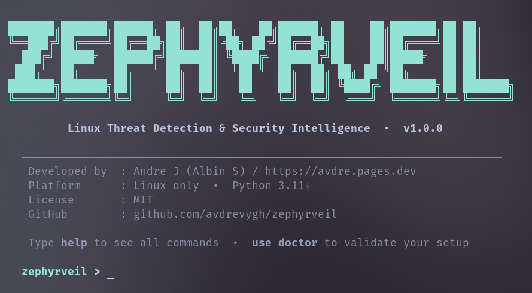

# Zephyrveil

**Linux Threat Detection & Security Intelligence**

A powerful CLI security console for Linux — inspired by Metasploit's interface. Parses system logs, detects intrusion attempts, enriches attacker IPs with threat intelligence, audits system security, generates reports, and sends Telegram alerts.

```
███████╗███████╗██████╗ ██╗  ██╗██╗   ██╗██████╗ ██╗   ██╗███████╗██╗██╗     
╚══███╔╝██╔════╝██╔══██╗██║  ██║╚██╗ ██╔╝██╔══██╗██║   ██║██╔════╝██║██║     
  ███╔╝ █████╗  ██████╔╝███████║ ╚████╔╝ ██████╔╝██║   ██║█████╗  ██║██║     
 ███╔╝  ██╔══╝  ██╔═══╝ ██╔══██║  ╚██╔╝  ██╔══██╗╚██╗ ██╔╝██╔══╝  ██║██║     
███████╗███████╗██║     ██║  ██║   ██║   ██║  ██║ ╚████╔╝ ███████╗██║███████╗
╚══════╝╚══════╝╚═╝     ╚═╝  ╚═╝   ╚═╝   ╚═╝  ╚═╝  ╚═══╝  ╚══════╝╚═╝╚══════╝
            Linux Threat Detection & Security Intelligence  v1.0.0
```

---

## Preview

<!-- Add a screenshot of Zephyrveil running in your terminal here -->
<!-- Take a screenshot, create a screenshots/ folder in this repo, upload it, then uncomment below -->

> *Screenshot coming soon*

<!--

-->

---

## Features

- **Interactive Console** — Metasploit-style CLI with `use`, `run`, `back`, `show options`
- **Log Parsing** — journalctl and `/var/log/auth.log` with custom file support
- **5 Threat Types** — SSH brute force, credential stuffing, root login, sudo abuse, repeated auth failures
- **Threat Intelligence** — IPInfo, AbuseIPDB, VirusTotal, Shodan, Fail2ban
- **System Audit** — security tools, open ports, firewall, SSH config, LUKS, sudo
- **CVE Check** — checks installed packages against NVD/NIST database
- **Reports** — PDF + JSON with full timestamp, never overwrites old reports
- **Telegram Alerts** — auto-sends when threats are detected during scan
- **Full History** — everything stored in SQLite, full history never deleted
- **Zero config** — auto-creates all files and directories on first run

---

## Install & Run

Zephyrveil runs from source. Clone the repo, install dependencies, and run. That's it.

---

### Method 1 — uv (Recommended)

`uv` is a modern Python package manager — much faster than pip and handles virtual environments automatically. This is the recommended way.

**Why uv?**
- Installs dependencies in seconds instead of minutes
- Automatically creates and manages the virtual environment for you
- No need to manually activate/deactivate anything
- Single command to run the project

**Install uv first (one time only):**

```bash
curl -LsSf https://astral.sh/uv/install.sh | sh
```

Then restart your terminal or run:

```bash
source $HOME/.local/bin/env
```

**Clone and run Zephyrveil:**

```bash
git clone https://github.com/avdrevygh/zephyrveil
cd zephyrveil
uv sync
uv run zephyrveil
```

That is all. `uv sync` installs all dependencies, `uv run zephyrveil` launches the tool.

**Next time you want to run it:**

```bash
cd zephyrveil
uv run zephyrveil
```

---

### Method 2 — pip (Standard Python)

If you prefer not to install uv or want to use standard Python tools:

```bash
git clone https://github.com/avdrevygh/zephyrveil
cd zephyrveil

# Create a virtual environment
python3 -m venv .venv

# Activate it
source .venv/bin/activate

# Install dependencies
pip install -r requirements.txt

# Run
python -m zephyrveil
```

**Next time you want to run it:**

```bash
cd zephyrveil
source .venv/bin/activate
python -m zephyrveil
```

---

## First Run

On first run, Zephyrveil automatically creates everything it needs — no manual setup required:

| Path | Purpose |
|------|---------|
| `~/.config/zephyrveil/config.toml` | Configuration and API keys |
| `~/.local/share/zephyrveil/zephyrveil.db` | SQLite database |
| `~/Documents/zephyrveil/` | PDF and JSON reports output |

After first launch run `use doctor` to check your setup and see what API keys are needed.

---

## Usage

```
zephyrveil > help            # Show all commands
zephyrveil > show options    # List all modules
zephyrveil > use scan        # Run full scan (recommended start)
zephyrveil > use log         # Parse logs and enrich all IPs
zephyrveil > use ip          # Investigate a single IP address
zephyrveil > use health      # Full system security audit
zephyrveil > use report      # Generate report from last scan
zephyrveil > use doctor      # Self-diagnostic — check everything
zephyrveil > use alerts      # Configure Telegram alerts
zephyrveil > clear           # Clear screen
zephyrveil > exit            # Quit
```

### Inside a module

```
zephyrveil > use scan
scan > show options          # See current settings
scan > set SOURCE auto       # Set log source
scan > set VERBOSE true      # Enable verbose output
scan > run                   # Execute the scan
scan > back                  # Return to main console
```

### Custom log file

```
scan > set SOURCE /home/user/honeypot.log
scan > run
```

---

## CLI Flags (non-interactive)

Run Zephyrveil directly from terminal without entering the console:

```bash
# uv
uv run zephyrveil --scan            # Run full scan and exit
uv run zephyrveil --health          # Run health audit and exit
uv run zephyrveil --ip 1.2.3.4      # Investigate single IP and exit
uv run zephyrveil --version         # Show version
uv run zephyrveil --verbose         # Enable verbose output
uv run zephyrveil --source /path    # Use custom log file

# pip / venv
python -m zephyrveil --scan
python -m zephyrveil --health
python -m zephyrveil --ip 1.2.3.4
```

---

## API Keys

All API keys are optional. Missing keys are skipped with a warning — Zephyrveil never crashes on a missing key.

Add keys to `~/.config/zephyrveil/config.toml` (auto-created on first run):

```toml
[api_keys]
abuseipdb  = "your_key_here"   # abuseipdb.com/api            — 1000 lookups/day free
ipinfo     = "your_key_here"   # ipinfo.io/signup              — 50,000/month free
virustotal = "your_key_here"   # virustotal.com/gui/my-apikey  — 500/day free
shodan     = "your_key_here"   # account.shodan.io             — limited free tier
nvd        = "your_key_here"   # nvd.nist.gov/developers       — free
```

Run `use doctor` inside the console to see which keys are missing and the exact URL to get each one.

---

## Telegram Alerts

Zephyrveil automatically sends a Telegram message when a scan detects threats.

**Setup via config.toml:**

```toml
[telegram]
bot_token = "your_bot_token"
chat_id   = "your_chat_id"
enabled   = true
```

**Setup via console:**

```
zephyrveil > use alerts
alerts > set TOKEN your_bot_token
alerts > set CHAT_ID your_chat_id
alerts > set TEST true
alerts > run
```

Get a bot token from [@BotFather](https://t.me/BotFather) on Telegram.

---

## Threat Detection Rules

| Threat | Trigger | Severity |
|--------|---------|----------|
| SSH Brute Force | 5+ failed logins from same IP | CRITICAL |
| Credential Stuffing | 3+ different usernames from same IP | HIGH |
| Root Login Attempt | Any root SSH login attempt | HIGH |
| Sudo Abuse | Failed sudo authentication | MEDIUM |
| Repeated Auth Failure | 10+ failures for same username | MEDIUM |

---

## Reports

Every scan automatically generates two timestamped report files:

```
zephyrveil_report_2025-01-15_14-32-05.pdf
zephyrveil_report_2025-01-15_14-32-05.json
```

Saved to `~/Documents/zephyrveil/` — old reports are never overwritten.

Reports contain everything: detected threats, full IP intelligence, system audit results, CVE findings, scan metadata, and timestamps.

---

## Database

All data stored at `~/.local/share/zephyrveil/zephyrveil.db`:

| Table | Contents |
|-------|---------|
| `scans` | Every scan session with metadata |
| `threats` | Every detected threat |
| `events` | Raw log events |
| `ip_intel` | IP enrichment results from all APIs |
| `audit_results` | System audit data |
| `alerts_sent` | Telegram alert history |

Full history — nothing is ever deleted. Query it directly with any SQLite tool.

---

## Keeping Zephyrveil Updated

```bash
cd zephyrveil
git pull

# uv — re-sync dependencies if anything changed
uv sync

# pip — reinstall dependencies if anything changed
source .venv/bin/activate
pip install -r requirements.txt
```

---

## Requirements

- Linux (Arch, Ubuntu, Fedora, Debian — any modern distro)
- Python 3.11+
- `journalctl` OR `/var/log/auth.log` access
- Internet connection for API features (works offline without keys)

---

## About the Developer

<!-- Fill in your details — remove any row you don't want public -->

| | |
|---|---|
| **Developer** | Andre J (Albin S) / @avdrevygh |
| **Location** | The Grid |
| **Background** | Cybersecurity, Ethical Hacking, Linux, Privacy |
| **GitHub** | [github.com/avdrevygh](https://github.com/avdrevygh) |
| **GitHub** | [avdre.pages.dev](https://avdre.pages.dev) |

> *Feel free to open an issue or suggest a feature.*

---

## License

MIT License — see [LICENSE](LICENSE) file.

Free to use, modify, and distribute.

---

*Zephyrveil v1.0.0 — Built for security professionals and learners alike.*
